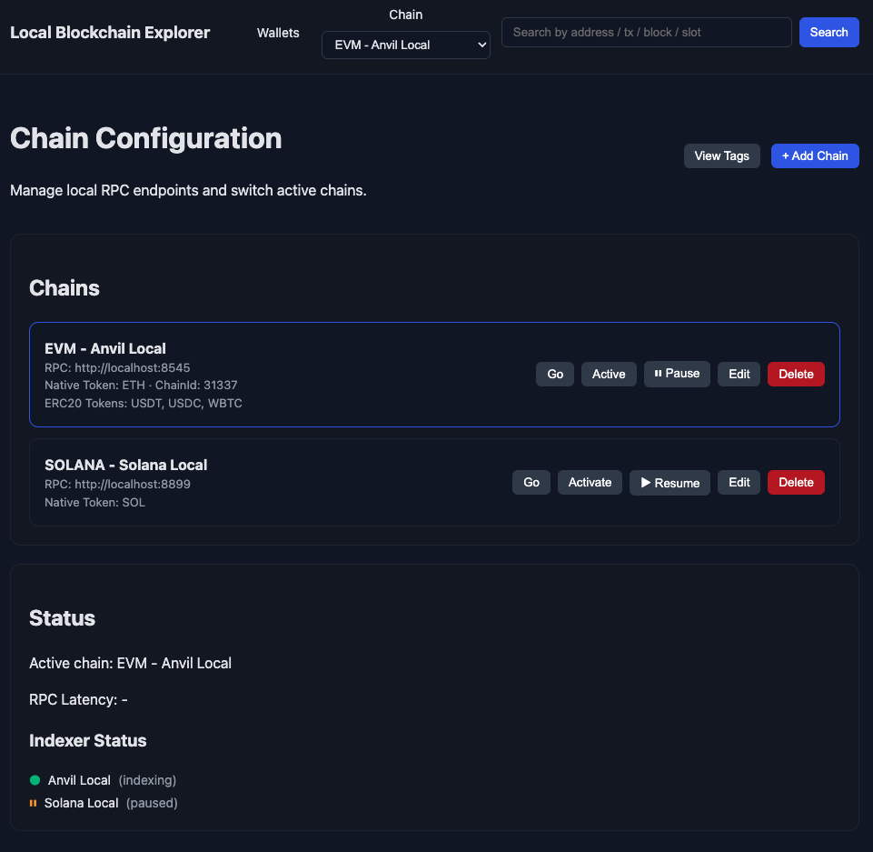
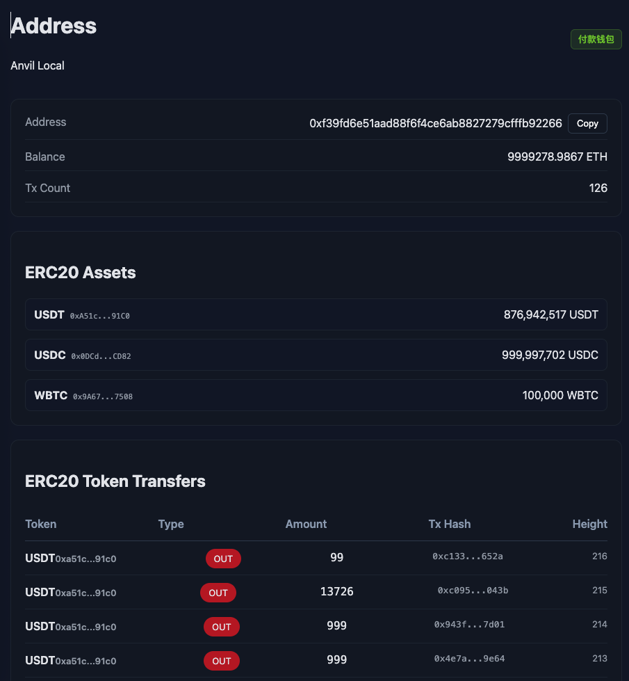
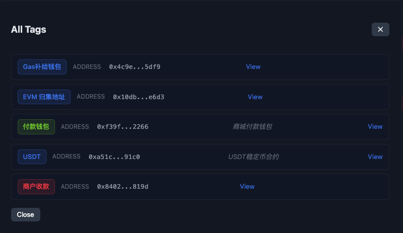
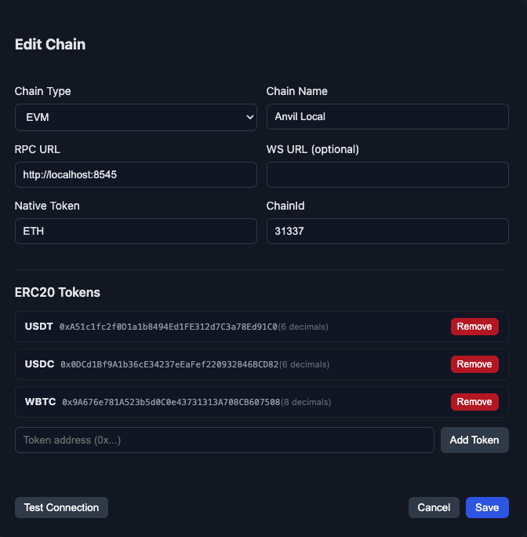
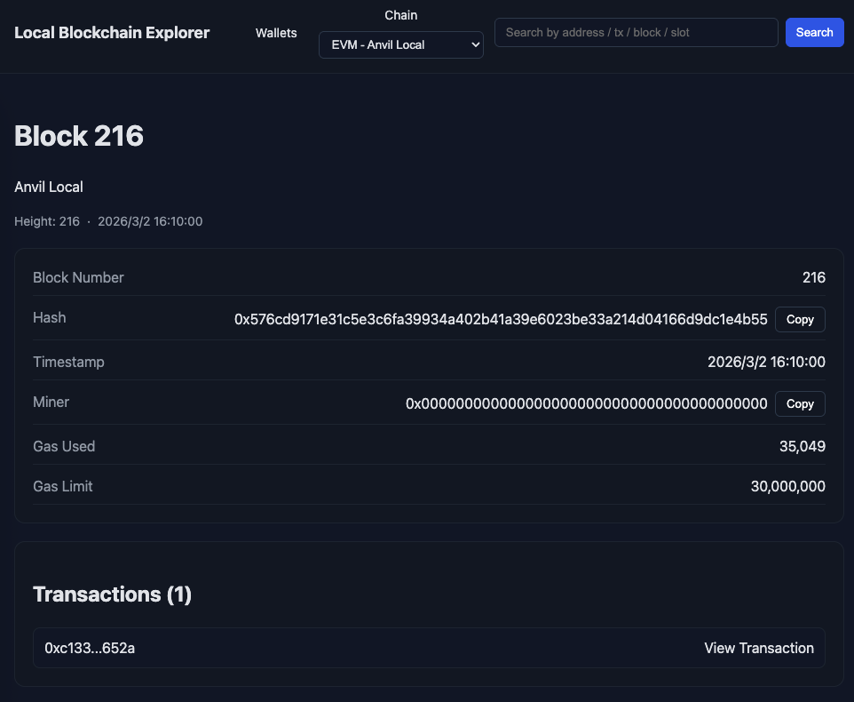

# Local Blockchain Explorer

English | [简体中文](README_CN.md)

A powerful local blockchain explorer for monitoring and inspecting EVM and Solana chains. Perfect for developers working with local testnets like Anvil, Hardhat, or Solana Test Validator.



## Features

### Block & Transaction Exploration
- **Real-time block monitoring** - View latest blocks with transaction counts, timestamps, and miner info
- **Transaction details** - Inspect transaction hashes, from/to addresses, gas usage, and status
- **Pagination support** - Browse through historical data with "Load More" functionality

### Multi-Chain Support
- **EVM Chains** - Ethereum, Anvil, Hardhat, Foundry, and other EVM-compatible chains
- **Solana** - Solana local testnet and mainnet support
- **Easy switching** - Switch between chains directly from the UI

### Wallet & Token Management
- **HD Wallet derivation** - Derive multiple wallets from a single mnemonic
- **Balance tracking** - View native and ERC20 token balances
- **SPL Token support** - Track Solana SPL tokens
- **Role-based organization** - Organize wallets by roles/projects



### Address & Transaction Tags
- **Custom tags** - Label addresses and transactions with custom names and colors
- **Quick identification** - Easily recognize your wallets and important transactions
- **Tag management** - View and manage all tags in one place



### Indexer Service
- **Automatic data collection** - Indexer automatically tracks blocks and transactions
- **Pause/Resume control** - Pause indexing for chains that aren't running
- **Historical data** - Configure backfill from genesis or recent blocks
- **Fast queries** - SQLite + Redis for quick data retrieval

## Quick Start

```bash
# Install dependencies
npm install

# Start Redis (required for caching)
brew services start redis  # macOS
# or: docker run -d -p 6379:6379 redis

# Start the indexer backend
npm run indexer:dev

# Start the explorer UI (in a new terminal)
npm run dev
```

Visit:
- Explorer UI: `http://localhost:5173`
- Indexer API: `http://localhost:7070`

## Usage

### Configure Chains

Go to **Config** page to add your chains:

1. Click **+ Add Chain**
2. Select chain type (EVM or Solana)
3. Enter RPC URL (e.g., `http://localhost:8545` for Anvil)
4. Add ERC20/SPL token addresses for balance tracking
5. Test connection and save



### Search & Explore

- **Search bar** - Find blocks by number, transactions by hash, or addresses
- **Home page** - View latest blocks and transactions with pagination
- **Click any item** - View detailed information



### Manage Wallets

1. Go to **Wallets** page
2. Create a role with your mnemonic phrase
3. Set derivation path (default: `m/44'/60'/0'/0` for EVM)
4. View balances for derived addresses

### Pause/Resume Indexing

If a test chain is stopped, pause indexing to avoid errors:

1. Go to **Config** page
2. Find the chain and click **⏸ Pause**
3. Click **▶ Resume** when the chain is running again

## Default Configuration

Out of the box, the explorer connects to:

| Chain | Type | RPC URL |
|-------|------|---------|
| Anvil Local | EVM | http://localhost:8545 |
| Solana Local | Solana | http://localhost:8899 |

## Configuration Options

Set environment variables to customize behavior:

| Variable | Default | Description |
|----------|---------|-------------|
| `REDIS_URL` | `redis://localhost:6379` | Redis connection |
| `SQLITE_PATH` | `./data/indexer.db` | Database file path |
| `INDEXER_API_PORT` | `7070` | API server port |
| `BACKFILL_FROM_GENESIS` | `true` | Index from block 0 |

## Scripts

| Command | Description |
|---------|-------------|
| `npm run dev` | Start explorer UI |
| `npm run indexer:dev` | Start indexer service |
| `npm run build` | Build for production |
| `npm run preview` | Preview production build |

## API Endpoints

The indexer exposes REST APIs at `http://localhost:7070`:

- `GET /chains` - List chains
- `GET /chain/:id/evm/blocks` - Get EVM blocks (supports `?limit=50&offset=0`)
- `GET /chain/:id/evm/txs` - Get EVM transactions
- `GET /chain/:id/evm/address/:address/txs` - Get address transactions
- `POST /chain/:id/pause` - Pause indexing
- `POST /chain/:id/resume` - Resume indexing
- `GET /roles` - List wallet roles
- `GET /tags` - List all tags
- `PUT /tags` - Create/update tags

## Tech Stack

- **Frontend**: React + Vite + TypeScript
- **Backend**: Node.js + Express
- **Database**: SQLite (data storage) + Redis (caching)
- **Styling**: CSS with dark theme

## License

MIT
